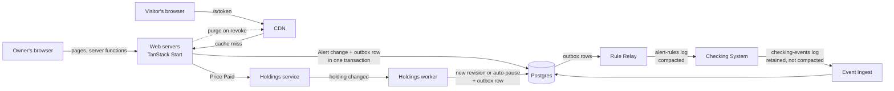
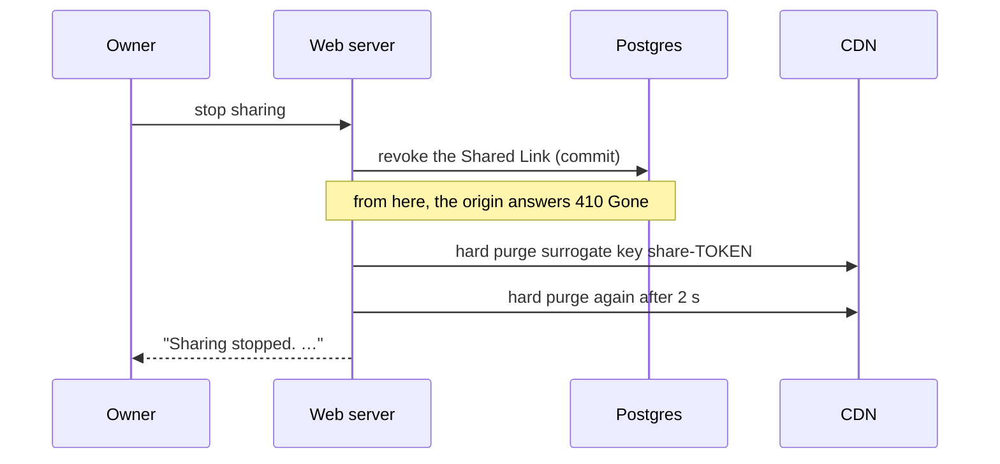

# Alerts — design

People who follow an instrument set up alerts on it, manage them, and can share one through a public link. This document designs the web application for that: the browser side, the web server, the workers that sit next to it, and where things are kept. Another team's **Checking System** evaluates the alerts and sends the notifications.

Capitalised terms (Alert, Rule Revision, Checked-through, …) are defined in [`CONTEXT.md`](../CONTEXT.md). Decisions that are hard to reverse have an ADR in [`docs/adr/`](./adr/).

## Contents

1. [Scope](#1-scope)
2. [Stack, and why](#2-stack-and-why)
3. [The domain](#3-the-domain)
4. [Parts, and what passes between them](#4-parts-and-what-passes-between-them)
5. [The rule contract](#5-the-rule-contract)
6. [Applying the Checking System's messages](#6-applying-the-checking-systems-messages)
7. [What people see](#7-what-people-see)
8. [Shared Links](#8-shared-links)
9. [Scenarios](#9-scenarios)
10. [What we build first, and why](#10-what-we-build-first-and-why)
11. [Step 2: what is built](#11-step-2-what-is-built)
12. [Assumptions to confirm with the Checking team](#12-assumptions-to-confirm-with-the-checking-team)

---

## 1. Scope

**Ours:** the pages an Owner uses to create and manage Alerts, the public page behind a Shared Link, the web servers and workers behind them, and their storage.

**Not ours:** the price feed, evaluating Rules, and sending notifications — the Checking System does all three. We never see a price except the one inside a Match. The instrument catalogue, sign-in and the Holdings service already exist on the site; we assume the Holdings service publishes an event whenever a Holding changes.

| Requirement (TASK.md) | Where |
|---|---|
| Set up, change, pause, delete an Alert | §3, §5, §11 |
| A Rule that uses the Owner's private data (Price Paid) | §3, [ADR-0001](./adr/0001-resolve-private-thresholds-before-the-checking-system.md) |
| Show on/off, last Match, how recently checked; a Rule change restarts history | §3, §6, §7 |
| An Owner with hundreds of Alerts | §7 |
| Share through a public link without exposing private information, even to the Owner | §8, [ADR-0002](./adr/0002-private-rules-are-never-shared.md) |
| Stop sharing, after which the link stops working | §8 |
| A popular Shared Link with thousands of Visitors a minute | §8, §9 |
| Keep working when the Checking System is down or delayed, without misleading anyone | §7, §9 |
| Restart, burst after a quiet spell, duplicate message, one hot link | §9 |

## 2. Stack, and why

| Choice | Why | Instead of |
|---|---|---|
| **TanStack Start** (React 19, SSR, server functions) | SSR gives Shared Link pages as complete HTML a CDN can cache; server functions give the Owner's pages typed, validated mutations without a separate API service. It is also what the scaffold uses. | An SPA plus a separate REST service: one more deployable, and the public page would still want SSR. |
| **Postgres** as the system of record | The load is small (about 100k Alerts); what matters is correctness. One transaction writes an Alert change and its outgoing rule message (an outbox); `INSERT … ON CONFLICT DO NOTHING` and `GREATEST()` make applying the Checking System's messages idempotent. | A key-value store: the hard part is transactions, not scale. |
| **Durable logs** (Kafka or equivalent) in both directions | Survives restarts and bursts on either side; see [ADR-0003](./adr/0003-durable-logs-between-web-app-and-checking-system.md). | HTTP webhooks into the web servers; the Checking System pulling from our API. |
| **CDN** with surrogate-key hard purge | Absorbs the only hot read path (popular Shared Links) close to Visitors, and can drop a revoked link on demand. | A Redis cache tier in front of Postgres: still sends every Visitor to our servers. |
| **Zod** | One schema for a Rule, run in the browser for feedback and on the server as the authority. | Duplicated validation. |
| **SQLite** (`node:sqlite`) — step 2 only | Zero setup for anyone running the build; kept behind one repository module so the SQL stays close to what Postgres would run. | Postgres in Docker: the build is about the write path, not the database. |

## 3. The domain

An **Owner** has any number of **Alerts**. Each Alert has:

- one **Instrument**, fixed for the Alert's life — an Owner may have several Alerts on the same Instrument;
- an optional **Alert Title**, private to the Owner;
- a state, **Active** or **Paused**;
- one **Rule**, of one **Rule Kind**:

| Rule Kind | Direction | Threshold | Rule Description (generated) |
|---|---|---|---|
| Price | goes above / goes below | a price the Owner enters | "AAPL goes below 300.00" |
| Price — a **Private Rule** | goes above / goes below | the Owner's **Price Paid**, resolved when saved | "AAPL goes below what you paid (291.40)" — Owner only |
| Percentage | rises / falls | N% from **Today's Open** | "BTC/USD falls 5% from today's open" |

A Volume kind was considered and dropped: the brief only promises that the Checking System sees prices, and "below" means nothing on a figure that restarts from zero every day.

**When a Rule matches.** A Rule matches when its condition *becomes* true, not continuously while it stays true, and re-arms once the condition is false again. If the condition already holds on the first check after the Rule is saved or resumed, that counts as becoming true — "tell me when AAPL is below 320", saved while AAPL is at 309, should tell the Owner now.

**Two counters.**

- `rule_revision` changes only when the Rule changes: a new kind, direction or threshold; switching between Price Paid and a typed price, even to the same number (the Rule's meaning changed); or a new Price Paid behind a Private Rule. Values are compared after normalising, so saving `5` over `5.00`, or saving the form unchanged, is not a change. A new Rule Revision clears the Alert's Matches.
- `version` goes up on every change to the Alert — Rule, title, pause, resume, delete. It orders rule messages for the Checking System and catches edits made from a stale page. It only ever increases, but the Checking System may see it skip numbers, because title changes send it nothing.

Pausing and resuming never make a Rule Revision, so the Match history is kept.

**Private Rules** ([ADR-0001](./adr/0001-resolve-private-thresholds-before-the-checking-system.md), [ADR-0002](./adr/0002-private-rules-are-never-shared.md)). The web server resolves Price Paid into a plain number when the Rule is saved; the Checking System gets only that number. The Rule follows the Holding:

- a new Price Paid gives each Private Rule on that Holding a new threshold and a new Rule Revision — even while the Alert is Paused, so resuming uses the right number;
- if the Holding is gone, the Alert is Paused automatically, with the reason shown ("You no longer hold AAPL");
- an Alert is never resumed automatically. Resuming a Private Rule checks that the Holding still exists and resolves Price Paid again;
- a save or resume that resolves Price Paid reads the Holding again after it commits, and if Price Paid changed in between, applies it as a holding change. Without that, a Holding that changed between the read and the commit would leave the Alert on the old number: the Holdings worker may already have run and found nothing to update;
- the Holdings worker reads the current Price Paid from the Holdings service rather than trusting the event, so a repeated, late or out-of-order holding event resolves to an unchanged number and makes no new Rule Revision.

**Who can see what.** Every server function takes the Owner from the session, never from its input, and every read or write of an Alert is scoped by its id *and* its Owner; someone else's Alert answers the same "not found" as a missing one. Alert ids are random, not sequential, and generated in the browser so a create can be retried (§9). Deleting an Alert keeps its row, marked deleted, so an id is never used twice: a create with a deleted Alert's id, or someone else's, is refused without saying which. The Owner sees their own Price Paid in the rule form — it is theirs.

## 4. Parts, and what passes between them



| Part | Does | Keeps |
|---|---|---|
| **Web servers** | Serve Owner pages, server functions and Shared Link pages. Several, stateless, behind a load balancer. | Nothing of record. |
| **Postgres** | System of record. | `alerts` (current Rule, `rule_revision`, `version`, state, title, when the log accepted the message that last armed it — the current revision or the latest resume; deleted Alerts stay as marked rows), `alert_pauses` (pause/resume moments for the current revision), `matches` (≤ 20 per Alert), `instrument_checks` (Checked-through per Symbol), `shared_links` (revoked tokens kept), `rule_outbox`, `dead_letters`. |
| **Rule Relay** | Publishes unpublished outbox rows, oldest first, to `alert-rules`, keyed by `alert_id`, and marks each one published with the log's own timestamp for it — the moment it was handed over. When that message armed the Rule, the Alert records the timestamp too. One active instance (leader lock). | Nothing of its own: the published mark lives on each outbox row. |
| **Event Ingest** | Applies `checking-events` to Postgres (§6). One consumer. | Its offset, committed after each database transaction. |
| **Holdings worker** | Turns holding changes into new Rule Revisions or automatic pauses. | Its offset. |
| **CDN** | Caches Shared Link pages and their JSON for a few seconds; purged on revocation. | Short-lived copies. |

Relay, Ingest and the Holdings worker are separate processes built from the same codebase, so a web server restart never stops them, and a burst of Checking System messages never competes with serving pages.

The Relay picks unpublished rows rather than keeping a position in the outbox: two saves can commit in the opposite order to their outbox ids, and a position would step past the row that committed late and never send it. Messages for one Alert still leave in `version` order, because the Alert's row lock makes its saves commit one after the other.

**What we watch**, and what it would take to change the design:

| Signal | Alarm when | If it keeps happening |
|---|---|---|
| Age of the oldest unpublished outbox row | over 30 seconds | The Relay or `alert-rules` is down; new Rule Revisions stay Not Yet Checked meanwhile. |
| Ingest lag (age of the message being applied) | over 60 seconds, the Stale threshold | Partition `checking-events` by Symbol and run one Ingest per partition (§12.7). |
| Rows in `dead_letters` | any | A contract mismatch with the Checking team, or a bug in Ingest. |
| Share of Instruments with Active Alerts that are Stale | most of them | The Checking System is down; this is what the banner in §7 reflects. |
| Failed CDN purges awaiting retry | any older than a minute | Revocation is slower than §8 promises. |
| Origin requests per Shared Link token | well above one per edge location per 10 seconds | Misses are not being collapsed; add an origin shield in front of the web servers. |

## 5. The rule contract

What the web app sends the Checking System: one full-state message per change, on the `alert-rules` log, keyed by `alert_id`.

```json
{"alert_id": "a-4417", "version": 12, "rule_revision": 7,
 "person_id": "person-ava", "symbol": "AAPL", "state": "active",
 "rule": {"kind": "price", "direction": "below", "threshold": "291.40"}}

{"alert_id": "a-9120", "version": 3, "rule_revision": 1,
 "person_id": "person-liam", "symbol": "BTC/USD", "state": "paused",
 "rule": {"kind": "percentage", "direction": "falls", "percent": "5", "baseline": "todays_open"}}

{"alert_id": "a-4417", "version": 13, "rule_revision": 7,
 "person_id": "person-ava", "symbol": "AAPL", "state": "deleted", "rule": null}
```

The first message is a Private Rule; nothing in it says so.

| Field | Meaning |
|---|---|
| `alert_id` | The Alert. The log key. |
| `version` | Orders messages for one Alert. Apply the highest you have seen; ignore anything lower. It may skip numbers. |
| `rule_revision` | The Rule Revision in force. Every Match must carry the revision that matched. |
| `person_id` | Whom to notify. The Alert Title is never sent. |
| `symbol` | The Instrument. Never changes for an `alert_id`. |
| `state` | `active` — check it. `paused` — do not check it or notify. `deleted` — forget it. |
| `rule.kind = price` | `direction`: `above` (price > `threshold`) or `below` (price < `threshold`). |
| `rule.kind = percentage` | `direction`: `rises` ((price − open) / open ≥ `percent`%) or `falls` ((open − price) / open ≥ `percent`%), with open = Today's Open. |
| Numbers | Decimal strings — SHIB/USD is quoted to 8 decimal places. |

**Semantics the Checking System implements:**

1. A Rule matches when its condition becomes true, and re-arms once it is false.
2. A message that arms a Rule — a new Rule Revision, or a resume — counts its first check as "became true" if the condition already holds.
3. Today's Open is the Instrument's first price of its current day; the Checking System decides when each Instrument's day starts (the session open, or 00:00 UTC for markets that never close).

**Delivery.** The Alert change and its message are written to the outbox in one transaction, so a message exists if and only if the change committed. The Relay publishes at least once; a repeat carries the same `version` and does nothing. The log is compacted, so reading it from the start gives the Checking System the full current rule set.

**Handing over is not checking.** The log accepting a message proves only that it was handed over. What would let us say a new Rule Revision has been checked is in §7 and §12.

## 6. Applying the Checking System's messages

Event Ingest reads `checking-events` **in arrival order**, applies up to 500 Matches (or 100 ms' worth) in one database transaction, and commits its offset only after that transaction commits. Checked-throughs do not count toward the 500: they are most of the traffic, and they coalesce in memory into one write per Symbol, so a backlog of them drains at the speed of reading the log rather than one database transaction per 500 messages. A crash in between replays the batch — delivery is at-least-once, and every step below is idempotent in effect, so a replay changes nothing.

Order matters because a Checked-through reaches us only after the Matches it covers: applying messages in arrival order means our database never holds "AAPL checked through 09:31:02" while a Match from before 09:31:02 is still missing. One consumer is plenty at this volume. If the log is ever partitioned, the Checking System must key both message kinds by Symbol — it knows each Alert's Symbol even though a Match does not carry it.

**A Match** — `event_id`, `alert_id`, `rule_revision`, `matched_at`, `price`:

1. Lock the Alert's row (so a Rule edit and a Match for it are applied one after the other). A batch locks its Alerts in `alert_id` order, as the Holdings worker does, so the two cannot deadlock. If the Alert is deleted or does not exist, drop the Match.
2. If `rule_revision` is lower than the Alert's current one, drop it: it matched an old Rule. A higher one cannot happen (we assign revisions before publishing them), so it goes to `dead_letters` and raises an alarm.
3. Insert it with its `rule_revision`, `ON CONFLICT (event_id) DO NOTHING`.
4. In the same transaction, prune the Alert's Matches to the 20 most recent by `(matched_at DESC, event_id DESC)` — event time, not arrival time, with `event_id` breaking ties.

**Duplicates.** Stored Matches are deduplicated by `event_id`. Because only 20 are kept, that deduplication is not permanent: a replay of an older Match that was already pruned can be inserted again — and is pruned again in the same transaction, because it is older than every Match kept. A replay of a pruned Match cannot change the visible history or the latest Match.

**A Checked-through** — `event_id`, `symbol`, `checked_through`: set the Symbol's Checked-through to `GREATEST(current, incoming)`. A duplicate or a late one changes nothing. Within a batch, each Symbol is written once, with the batch's latest value.

**Match After Pause** is worked out when reading, not when storing: a Match whose `matched_at` falls inside one of the current revision's pause intervals is labelled as reported after the pause. This way it does not matter whether the pause or the Match reached us first. The pause moment comes from our clock and `matched_at` from the Checking System's, so the boundary is only as sharp as the skew between them — milliseconds.

**Anything malformed** goes to `dead_letters` with the raw message, and Ingest moves on; it never blocks the log. If a batch's transaction is rejected (rather than the database being unreachable, where Ingest just waits and retries), Ingest applies the same messages again one at a time; a message that still fails on its own goes to `dead_letters`, so one bad message cannot hold back the rest.

Reads filter Matches by the Alert's current `rule_revision` as well, so a Match that raced a Rule edit can never be shown against the new Rule.

## 7. What people see

### The Owner's Alerts

One query loads all of the Owner's Alerts, each with its Instrument's Checked-through and its latest Match — no query per Alert. Hundreds of rows is a small payload, so there is no pagination; a limit of 1,000 Alerts per Owner keeps it that way, and paging on the server is the change if that limit ever has to rise; search (title, Symbol, Rule Description), filters (Active/Paused, Rule Kind, Symbol) and sorting (recently matched, Symbol, newest) run in the browser.

The page refetches every 15 seconds while it is visible, and when it regains focus. Not SSE or websockets: an Owner's list changes slowly, ages tick in the browser anyway, and polling survives web server restarts with no sticky connections and no fan-out from Ingest to the web tier.

Times travel as absolute UTC and are turned into "4 min ago", the reader's time zone and the reader's language in the browser — so a page that was cached or left open never claims "5 seconds ago" for minutes. Rule Descriptions are generated from the Rule, so they can be shown in any language; an Alert Title is the Owner's own text and is shown as written.

### Status: current, stale, or not yet checked

**The Instrument** (Checked-through, from `instrument_checks`):

| Situation | Shown |
|---|---|
| Checked-through at most **60 seconds** old | **Current**: "Checked through 09:31:02" |
| Older than 60 seconds | **Stale**: "Checked through 09:31:02 (4 min ago). Checking is delayed; matches after this time may not be shown yet." |
| Every Instrument with an Active Alert is Stale | A banner: the Checking System is delayed. |
| No Checked-through has arrived yet (a Symbol's first Alert) | No time is shown; its Alerts are Not Yet Checked. |

Checked-through normally arrives every few seconds, so 60 seconds is generous without leaving people uninformed for long. Current or Stale is decided in the browser, from the absolute Checked-through and the browser's clock, not in the page the server rendered — so a page that stops refreshing (cached, left open, or unable to reach us) turns Stale on its own instead of staying Current.

**The Alert:**

| Situation | Shown |
|---|---|
| The current Rule Revision is not known to be covered | **Not Yet Checked** — and no "no matches" claim of any kind. |
| Covered, a Match exists | "Last matched 09:30:58 at 316.46" |
| Covered, no Match | "No matches since this rule was saved, as of 09:31:02" — never a bare "No matches". |
| The latest Match is a Match After Pause | The same line, labelled "reported after you paused this alert". |
| Paused | "Paused" (with the reason, if the pause was automatic). The latest Match is still shown; no freshness claim. |

Nothing ever says or implies that the Owner was notified: no message tells us what the Checking System sent.

**What "covered" means.** A Rule Revision is covered once its Instrument's Checked-through is at or after the moment the log accepted the message that armed it (the new revision, or the latest resume) — the log's own timestamp on that message, which the Relay records (§4) and the Checking System can read too, so both sides compare against the same clock. A message the Relay has not published yet is not covered. That is only true if the Checking System makes the ordering promise in §12. Until the Checking team confirms it, it is an assumption. If they cannot promise it, we fall back to claiming nothing per Rule: show the Instrument's freshness and any Matches received, and never say "no matches" for a new revision. A Match that carries the revision is always proof it was checked. We deliberately do not add a grace period ("covered once Checked-through is a minute past handover") — time passing proves nothing about what was checked.

## 8. Shared Links

**What can be shared.** At most one working Shared Link per Alert, for any Alert without a Private Rule ([ADR-0002](./adr/0002-private-rules-are-never-shared.md)). Editing a shared Alert into a Private Rule is allowed, but the form warns that saving will stop sharing, and saving does. Deleting an Alert stops sharing it. Both stop sharing in the same transaction as the change, then purge the CDN exactly as stopping sharing does below.

**The token.** 128 random bits, in `/s/<token>`. Stopping sharing marks it revoked; the row is kept, so the origin can tell a dead link (410 Gone) from one that never existed (404), and so a token is never issued twice. Sharing again mints a new one, so an old link never comes back.

**The public projection.** Everything a Shared Link shows is read through one query-and-serializer that:

- selects an explicit list of public columns — never the Alert Title, never anything derived from a Holding;
- refuses Private Rules in the query itself (a second guard behind the form, which never offers sharing for them);
- describes the Rule with the generated Rule Description, never with Owner-written text.

It is built and tested in step 2. **The future `/s/$token` route and its JSON must read through this projection and nothing else.**

**What a Visitor sees.** The Symbol and Instrument name, the Rule Description, Active/Paused, the latest Match (time, price, and the Match After Pause label if it applies), and the Instrument's Checked-through as an absolute time, with Not Yet Checked shown the same way as for the Owner. No Owner name or email.

**The same for everyone.** Shared Link pages render outside the personalised root layout (today the root loader reads the session on every page): they read no cookie, never set one, and show no signed-in header, so the Owner opening their own link sees exactly what any Visitor sees. The CDN strips cookies from these requests, so a cached copy can never carry anyone's session. Language comes from the path (`/fr/s/<token>`), not from headers or cookies, so the cache key stays the URL.

**Caching.** Pages and their JSON are served with `Cache-Control: public, max-age=0, s-maxage=10` and `Surrogate-Key: share-<token>` — browsers keep nothing, the CDN keeps a copy for at most 10 seconds. There is no `stale-while-revalidate` or `stale-if-error` on these routes: both would serve a revoked link. The CDN collapses concurrent misses, so however many Visitors arrive, each edge location sends our servers roughly one request per link per 10 seconds, and each costs one indexed query. The page polls `/s/<token>.json` every 15 seconds under the same headers.

**Stopping sharing.**



The second purge, 2 seconds later (the origin timeout for these routes), catches a response that read the database just before the revocation and was cached just after the first purge. A purge that fails is retried by a job.

**The guarantee, stated precisely.** Our servers stop serving the Alert the moment the revocation commits: from then on the origin answers 410 Gone. A CDN edge may still serve a copy it cached earlier, for at most the 10 seconds it was allowed to keep it. The two purges make that unlikely but do not prove instant revocation at every edge, so the Owner is not promised it: "Sharing stopped. The link no longer works; copies cached along the way can take up to 10 seconds to clear." The 410 is itself cached for a minute, so a dead link that is still popular does not reach our servers; a 404 for an unknown token is cached the same way.

## 9. Scenarios

### The web server restarts

Nothing of record lives in a web server process. A save in flight either committed — the Alert change and its outbox row together — or did not; the browser shows an error, and retrying is safe: a create carries an Alert id generated in the browser, so a repeat returns the existing Alert, and an edit carries the `version` it was based on, so a repeat cannot apply twice. Pages that poll simply poll again; there are no sticky sessions or open connections to restore. The Relay, Ingest and Holdings worker are separate processes and keep running. When *they* restart, the Relay re-sends messages it had not marked published (the Checking System ignores a `version` it has seen), and Ingest replays from its last committed offset (§6 makes that harmless).

### The Checking System delivers a large batch after a quiet spell

While it is quiet, each Instrument goes Stale 60 seconds after its last Checked-through, and every page says checking is delayed. Owners can still create, edit and pause Alerts — the outbox and `alert-rules` hold the messages; new Rule Revisions show Not Yet Checked.

When the backlog lands, nothing has been lost: `checking-events` is not compacted and its retention outlasts the longest outage we plan for. Ingest drains it in order, in batches — one Checked-through write per Symbol per batch, Matches inserted and pruned per Alert, Matches for old revisions dropped. Because order is preserved, Checked-through never runs ahead of the Matches it covers. Status stays Stale until Checked-through is back within 60 seconds of now, so no page looks current while it is still catching up. The backlog is mostly Checked-throughs: with, say, 5,000 Instruments carrying Alerts and one Checked-through each every 3 seconds, a day's silence is about 150 million messages. Because they coalesce to one write per Symbol per batch and do not count toward its 500-Match limit (§6), Ingest drains them at the rate it can read the log — tens of thousands a second, well under an hour for that day — not at the rate of database transactions. A burst concentrates on a few popular Instruments (a sharp move in the S&P 500 can match thousands of Alerts at once); that is a large batch for Ingest, not a load on the web tier. Ingest lag is monitored and alarmed.

### The same message arrives twice

A repeated Match hits `event_id` and does nothing; if the original was already pruned, the repeat is inserted and pruned in the same transaction and cannot change what is shown (§6). A repeated or late Checked-through cannot move `GREATEST()` backwards. On the Checking System's side, a repeated rule message carries a `version` it has already applied. A repeated holding event resolves to an unchanged Price Paid and makes no Rule Revision (§3).

### One Shared Link takes most of the traffic

The CDN serves it: each edge location asks our servers for it about once every 10 seconds, whatever the number of Visitors, and our cost per request is one indexed query. The page is identical for every Visitor, so nothing varies the cache key. Stopping sharing works as in §8, even for the hottest link.

### The Checking System is down or delayed

Every page keeps working and none of it becomes misleading: Instruments show as Stale with their last Checked-through; new Rule Revisions show Not Yet Checked; nothing says "no matches" that has not been covered; writes keep being accepted and queued.

The same holds when our side of the link fails. If `alert-rules` is unreachable, saves still commit, the outbox holds their messages until the Relay can publish them, and those Rule Revisions stay Not Yet Checked. If the Holdings service is unreachable, saving or resuming a Private Rule fails with a message saying so; every other Rule saves normally, and holding changes wait on their log for the Holdings worker.

### Late, out-of-order, and stale Matches

A Match for an older Rule Revision, arriving after an edit, is dropped. A Match for a deleted Alert is dropped. Matches arriving out of order are ordered by `matched_at`, so "Last matched" is the latest event, not the latest arrival.

## 10. What we build first, and why

**Writing a rule — the part step 2 names.** We would have picked it too:

- The alerts do not exist yet. Ingest, status and sharing all need Alerts to act on.
- It produces the contract the Checking team is waiting for: the rule message, `rule_revision`, `version` and the semantics in §5. Across two teams, that contract is the long pole.
- It holds the privacy decision that shapes everything downstream: Private Rules are resolved into plain numbers before anything leaves our system.

**Next: Ingest**, because that is where the correctness risk lives — duplicates, ordering, old revisions, bursts. It can be built and tested against recorded or synthetic messages before the Checking System exists. Then the Owner's status view, then Shared Links.

## 11. Step 2: what is built

- An Owner can create, edit, pause, resume and delete Alerts: Price (a typed price, or Price Paid for an Instrument they hold) and Percentage, with an optional Alert Title. Pages: `/alerts` (search, filter, sort), the new/edit form, and "Create alert" on each Instrument page.
- Alerts are kept in SQLite (`node:sqlite`), in a file under `./data/`, created on first start — a person who comes back finds the same Alerts.
- Every change that the Checking System would need writes the full-state rule message of §5 to the outbox, in the same transaction. Nothing publishes it yet.
- `rule_revision` and `version` behave as in §3: Rule changes clear Matches; unchanged saves are no-ops; stale edits are rejected with the latest version shown; creating twice with the same id makes one Alert.
- The public projection of §8 is built and tested; no Shared Link route uses it yet.
- Status is honest about what is missing: with no Relay, nothing has been handed to a Checking System, so every Alert shows **Not yet checked** and no Matches.
- **Not built:** Relay, Ingest, Checked-through, Shared Link routes and revocation, the Holdings worker, re-reading Price Paid after a save, the per-Owner limit, polling, the CDN. Sign-in stays the scaffold's demo persona cookie — unsigned, a stand-in for the site's real session.

Tests sit at two seams. Vitest drives the alerts domain module with an in-memory database and holdings injected: validation, revisions, stale edits, idempotent create, Private Rule resolution, the outbox, the public projection, and Owner scoping on the server. Playwright drives the browser path: create, reload, edit, pause and resume, and the other persona getting "not found" for an Alert that is not theirs. How to run it is in the [README](../README.md).

## 12. Assumptions to confirm with the Checking team

1. **Coverage (the ordering promise).** Before sending a Checked-through of T for a Symbol, the Checking System has applied every rule message for that Symbol whose log timestamp is at or before T. Without it, we fall back as described in §7.
2. **Rule semantics.** Matching when the condition becomes true; re-arming when it is false; the first check after arming counts (§5).
3. **Today's Open.** Defined per Instrument by the Checking System: the session open, or 00:00 UTC for markets that never close.
4. **Rule messages.** Full state per `alert_id`; apply the highest `version`, which may skip numbers; `state: "deleted"` means forget.
5. **Matches carry the `rule_revision` that matched**, including Matches still in flight after a newer revision arrives.
6. **Paused Alerts** are neither checked nor notified; a Match that happened before the pause reached them can still arrive afterwards.
7. **Partitioning.** If `checking-events` is ever partitioned, both message kinds for one Symbol go to the same partition, in order.
8. **Retention.** `checking-events` keeps events at least as long as the longest outage we plan for — for example, 7 days.
9. **No volume data** is assumed; Rules use prices only.
10. **`price` in a Match** is the matched price, in the Instrument's quote currency.
